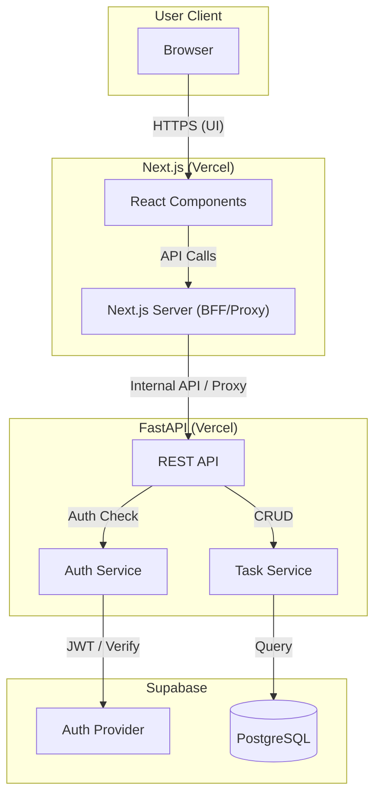
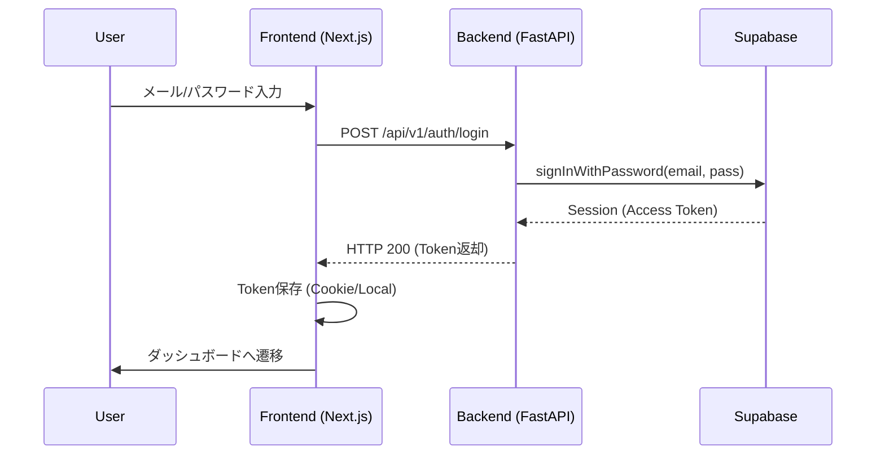
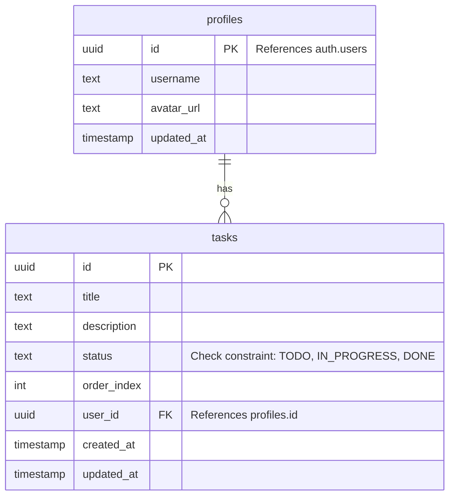

# 設計書 (Design Document)

---
**目的**: 実装者間の解釈のブレを防ぎ、一貫した実装を保証するための詳細を提供する。

**アプローチ**:
- 実装判断に直結する必須セクションを含める
- 実装ミスを防ぐために重要な場合を除き、オプションのセクションは省略する
- 機能の複雑さに応じた詳細レベルにする
- 長い散文よりも図や表を使用する
---

## 概要 (Overview)

本機能は、ユーザーが個人のタスクを視覚的に管理できる Kanban スタイルの Todo アプリケーションである。フロントエンドとバックエンドを分離したモノレポ構成を採用し、モダンな UI と堅牢な API を提供する。

### 目標 (Goals)
- フロントエンド (Next.js) とバックエンド (FastAPI) を完全に分離したモノレポ構成の確立
- Supabase を活用した認証およびデータ永続化
- Docker を使用した再現性の高い開発環境の提供
- Vercel への統合デプロイメント

### 非目標 (Non-Goals)
- リアルタイムコラボレーション（WebSocket等）
- 複雑な権限管理（今回は個人タスク管理のみ）

## アーキテクチャ (Architecture)

### アーキテクチャパターンと境界 (Architecture Pattern & Boundary Map)

**Monorepo Split Architecture** を採用する。フロントエンドはプレゼンテーションとユーザー操作に集中し、バックエンドはビジネスロジックとデータアクセス、認証のゲートウェイとして機能する。

**アーキテクチャ統合**:
- **パターン**: Backend for Frontend (BFF) 的な Next.js と、ピュアな REST API (FastAPI) の組み合わせ。
- **境界**:
  - `frontend/`: UI 描画、クライアント状態管理、バックエンド API へのプロキシ。
  - `backend/`: データベース操作、認証ロジック、API 定義。
- **ステアリング準拠**: モノレポ構成によるコードベースの一元管理。

### 技術スタック (Technology Stack)

| レイヤー | 選択 / バージョン | 役割 | 備考 |
|----------|-------------------|------|------|
| Frontend | Next.js 16 / TypeScript | UI / BFF | App Router 使用 |
| Backend | Python 3.14 / FastAPI | REST API | `uv` でパッケージ管理 |
| Database | Supabase (PostgreSQL) | データストア | バックエンドからアクセス |
| Auth | Supabase Auth | 認証基盤 | バックエンド経由で利用 |
| Infra | Docker / Vercel | 開発 / デプロイ | モノレポ対応設定 (無料枠で実現可能) |

## システムフロー (System Flows)

### ログインフロー (Login Flow)

## 要件追跡 (Requirements Traceability)

| 要件ID | 概要 | コンポーネント | インターフェース |
|--------|------|----------------|------------------|
| 1.1, 1.2 | ログイン認証 | FE: LoginForm, BE: AuthRouter | POST /auth/login |
| 1.3 | ログアウト | FE: UserMenu, BE: AuthRouter | POST /auth/logout |
| 2.1 - 2.4 | ユーザー登録 | FE: RegisterForm, BE: UserRouter | POST /users/register |
| 3.1 - 3.4 | ユーザー情報管理 | FE: ProfilePage, BE: UserRouter | PUT /users/me |
| 4.1 - 4.3 | タスク管理・Kanban | FE: KanbanBoard, BE: TaskRouter | GET/POST/PUT /tasks |
| 5.1, 5.2 | 多言語対応 | FE: i18nProvider | - |

## コンポーネントとインターフェース (Components and Interfaces)

### コンポーネントサマリ (Summary)

| コンポーネント | ドメイン/層 | 意図 | 要件 | 依存 (P0:必須) | 契約 |
|----------------|-------------|------|------|----------------|------|
| `frontend/app` | UI | 画面描画とルーティング | 5.1-5.3 | Backend API (P0) | - |
| `backend/main` | API | エントリーポイントと設定 | - | FastAPI (P0) | HTTP |
| `backend/routers/auth` | Auth | 認証処理のハンドリング | 1.1-1.5 | Supabase Client (P0) | API |
| `backend/routers/tasks` | Task | タスクCRUDの実装 | 4.1-4.5 | Supabase DB (P0) | API |

### [Domain: Backend API]

#### Auth Router (`backend/routers/auth.py`)

| 項目 | 詳細 |
|------|------|
| 意図 | ログイン、登録、トークン管理のエンドポイントを提供する。 |
| 要件 | 1.1, 1.2, 2.1 |

**責任と制約**
- Supabase Auth SDK をラップして利用する。
- パスワード等の機密情報はログ出力しない。

**API Contract**

| Method | Endpoint | Request | Response | Errors |
|--------|----------|---------|----------|--------|
| POST | `/api/v1/auth/login` | `{email, password}` | `{access_token, token_type}` | 401 |
| POST | `/api/v1/auth/signup` | `{email, password, name}` | `{msg, user_id}` | 400, 409 |

#### Task Router (`backend/routers/tasks.py`)

| 項目 | 詳細 |
|------|------|
| 意図 | タスクの取得、作成、更新、削除、並び替えを行う。 |
| 要件 | 4.1, 4.2, 4.3 |

**責任と制約**
- 認証済みユーザー (`Depends(get_current_user)`) のみアクセス可能。
- `user_id` に紐づくデータのみを操作する（Row Level Security 相当のフィルタリングをアプリ側でも意識する）。

**API Contract**

| Method | Endpoint | Request | Response | Errors |
|--------|----------|---------|----------|--------|
| GET | `/api/v1/tasks` | - | `List[Task]` | 401 |
| POST | `/api/v1/tasks` | `TaskCreate` | `Task` | 422 |
| PUT | `/api/v1/tasks/{id}` | `TaskUpdate` | `Task` | 404 |

### [Domain: Frontend UI]

#### KanbanBoard (`frontend/components/KanbanBoard.tsx`)

| 項目 | 詳細 |
|------|------|
| 意図 | タスクを列ごとに表示し、DnD操作を提供する。 |
| 要件 | 4.1 - 4.3 |

**Implementation Notes**
- `dnd-kit` を使用。
- ドロップ時に `PUT /api/v1/tasks/{id}` を呼び出し、ステータスと `order_index` を更新する。

## データモデル (Data Models)

### 物理データモデル (Physical Data Model - Supabase/PostgreSQL)

**実装ノート**:
- Supabase の `auth.users` テーブルと連携するため、`profiles` テーブルを作成し、トリガーを用いて `auth.users` 作成時に自動的にレコードを作成するパターンを推奨するが、今回はシンプルにバックエンド API 経由で操作することを主とするため、API ロジック内で整合性を保つ。

## エラーハンドリング (Error Handling)

### エラー戦略
- **Backend**: FastAPI の `HTTPException` を使用し、JSON 形式でエラー詳細（code, message）を返す。
- **Frontend**: API クライアント（axios または fetch ラッパー）でステータスコードを監視し、401 ならログイン画面へ、それ以外は Toast 通知でエラーを表示する。

## テスト戦略 (Testing Strategy)

### Unit Tests
- **Backend**: `pytest` を使用。Router のロジック、Pydantic モデルのバリデーションをテスト。DB 依存部分は `unittest.mock` でモック化。
- **Frontend**: `Vitest` + `React Testing Library` でコンポーネントのレンダリングテスト。

### Integration Tests
- **API**: Docker コンテナ上のテスト用 DB に対して実際にリクエストを投げる API テスト。

## 開発・デプロイ構成 (Dev & Ops)

### 開発環境 (Local Development)
- **Supabase Stack**: `supabase start` (CLI) を使用。
  - 含まれるサービス: Postgres, Auth (GoTrue), Rest API (PostgREST), Realtime, Storage, Studio (Dashboard)。
  - アクセス: Studio (`http://localhost:54323`), API (`http://localhost:54321`).
- **App Stack**: `docker-compose.yml` で管理。
  - `frontend`: Node.js 20+, Next.js 16 (Port 3000)。
  - `backend`: Python 3.14, FastAPI (Port 8000)。
  - **Network**: `host.docker.internal` を介して Supabase サービスと通信、または同一 Docker ネットワークに参加。
- **Environment Variables**:
  - `.env.local` (Frontend), `.env` (Backend) に Supabase のローカル URL と Anon Key を設定。

### デプロイ (Deployment Strategy)
- **Platform**: Vercel (Frontend & Backend) / Supabase (Database)
- **Method**: GitHub Actions を使用した Vercel CLI および Supabase CLI によるデプロイ
- **Flow**:
  1. `main` ブランチへのプッシュをトリガー。
  2. GitHub Actions ランナーが起動。
  3. **Database Migration**:
     - `supabase/setup-cli` アクションで CLI をセットアップ。
     - `SUPABASE_ACCESS_TOKEN`, `SUPABASE_DB_PASSWORD`, `SUPABASE_PROJECT_ID` を使用して認証・リンク。
     - `supabase db push` を実行し、`supabase/migrations/` 内の SQL を適用。
  4. **App Deployment**:
     - `VERCEL_TOKEN`, `VERCEL_ORG_ID`, `VERCEL_PROJECT_ID` を使用して認証。
     - GitHub Secrets (`SUPABASE_URL`, `SUPABASE_KEY` 等) を環境変数として注入。
     - `vercel deploy --prod` を実行してデプロイ。
- **Configuration**:
  - `vercel.json`: ルーティングとビルド設定を記述。
  - `.github/workflows/deploy.yml`: デプロイパイプライン定義。