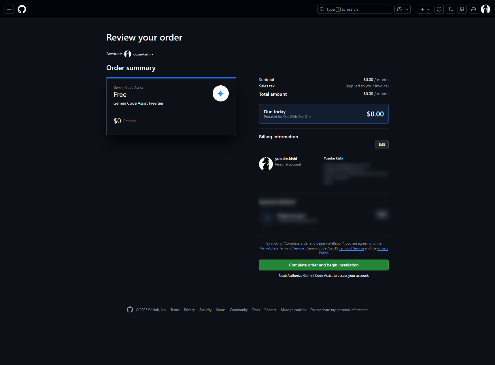
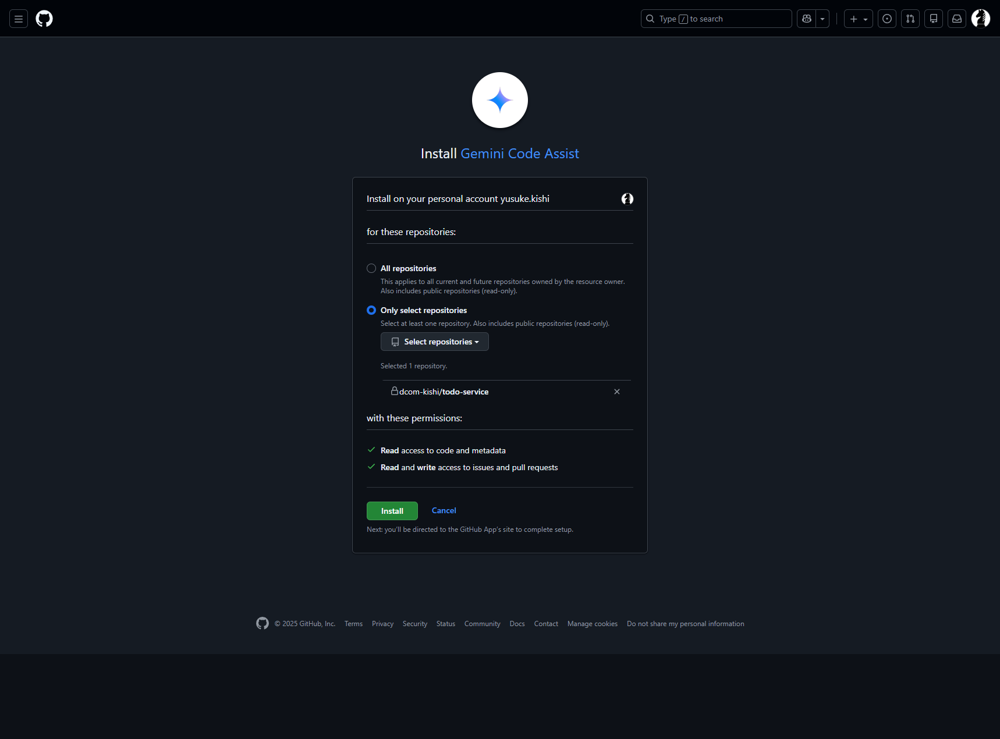
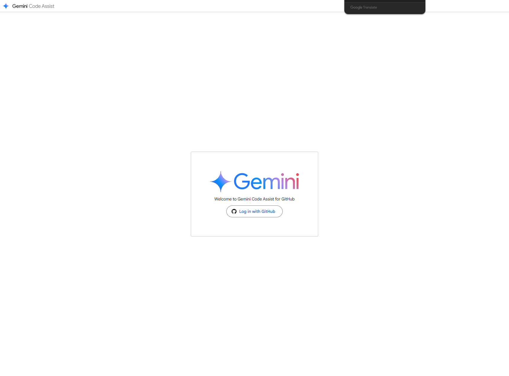
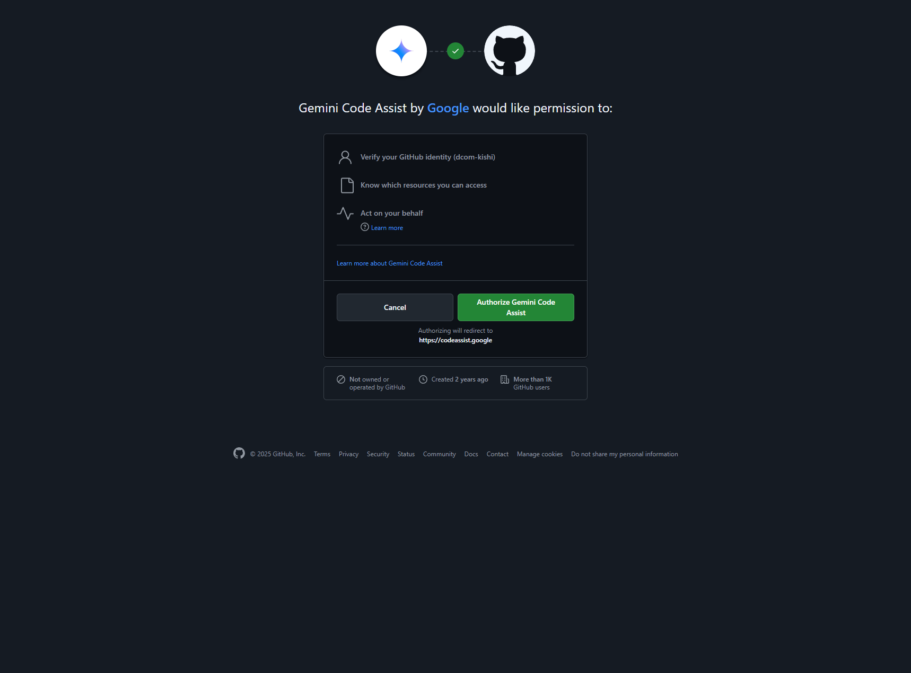
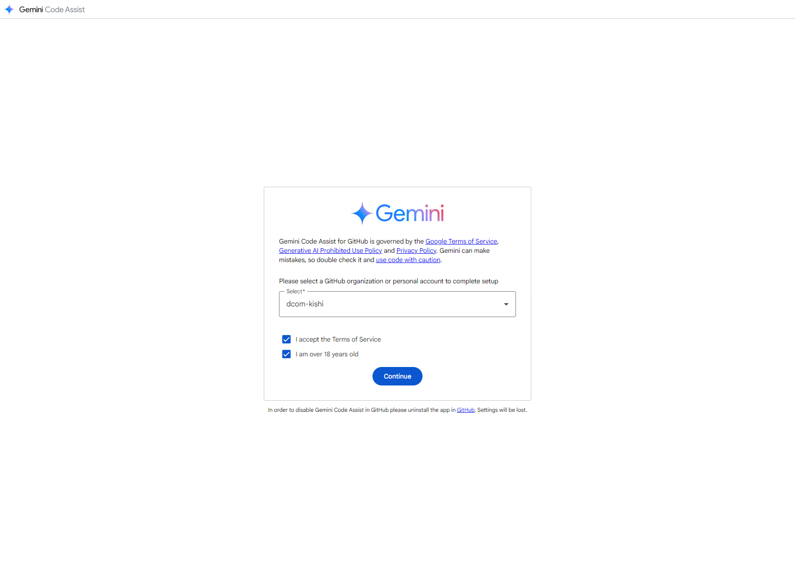
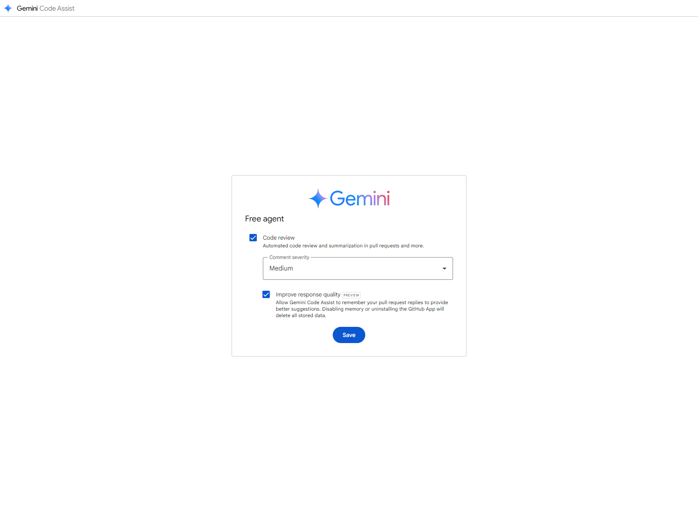
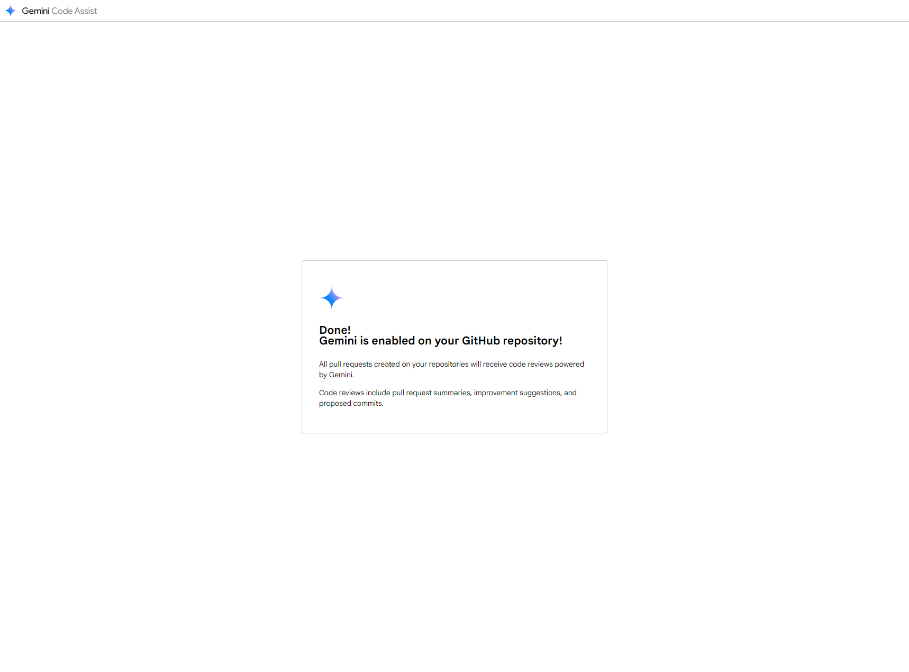
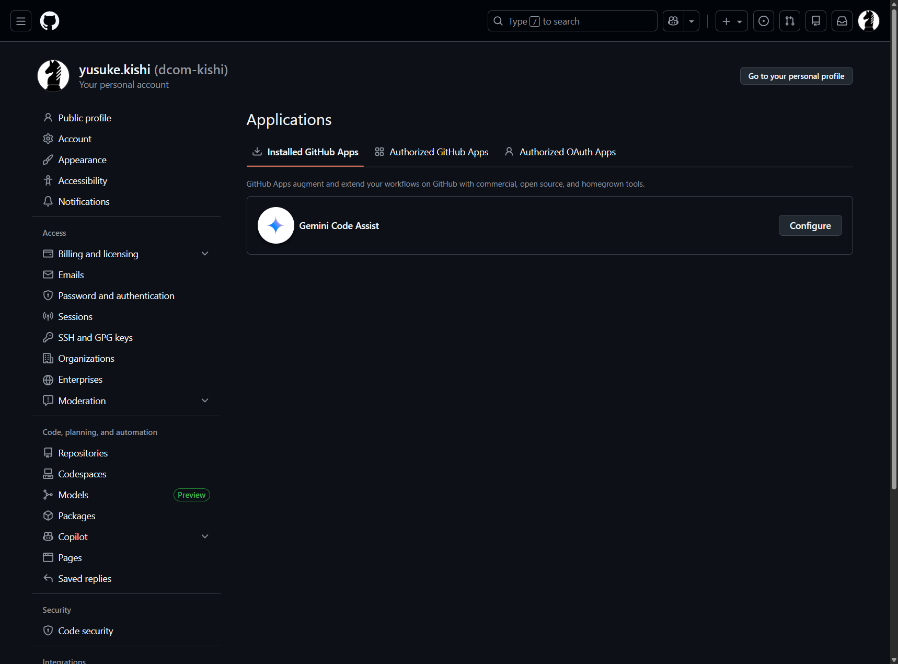

# Github リポジトリと gemini-code-assist セットアップ

1. 以下にアクセスして `Install` を選択する
https://github.com/marketplace/gemini-code-assist

2. `Complete order and begin installation` を選択する

3. `Only select repositories` で追加したいリポジトリを選択する
`Install` を選択する

4. `Log in with Github` を選択する

5. `Authorize Gemini Code Assist` を選択する

6. ユーザーを選択し、`I accept the Terms of Service`, `I am over 18 years old` にチェックして `Continue` を選択する

7. `Code review` と `Improve response Quality` にチェックして `Save` を選択する
`Comment severity` は `Medium` にしておく

8. 以下のように Github に追加されていれば OK です

