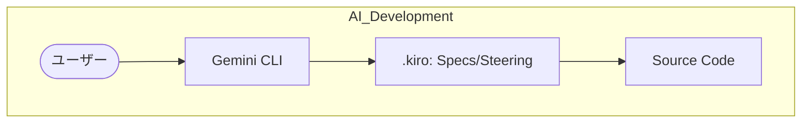
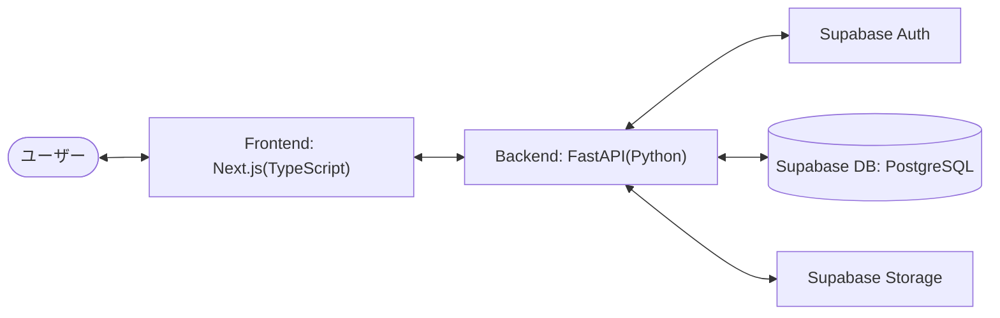

# プロジェクト発表資料案: todo-kanban (旧 todo-service)

## 1. 要素技術

本プロジェクトは、**AI-DLC (AI Development Life Cycle)** と **Spec-Driven Development (SDD: 仕様駆動開発)** を核とした、AIネイティブな開発手法で構築されています。

### リポジトリへの導入方法 (Setup)

新規プロジェクトに `cc-sdd` の仕組みを導入するには、以下の手順を実行します。

1. **Gemini CLI の準備**:
   Gemini CLI (`npm install -g @google/gemini-cli`) をインストールし、初回ログインを完了させます。

2. **環境構築コマンドの実行**:
   プロジェクトのルートディレクトリで以下のコマンドを実行します。

   ```bash
   npx cc-sdd@latest --gemini --lang ja
   ```

   ※ このコマンドにより、`.gemini/commands/kiro/` や `.kiro/settings/` などのボイラープレートが自動生成されます。

3. **カスタムコマンドの有効化**:
   Gemini CLI を起動すると、セットアップされた `/kiro:*` コマンドが自動的に読み込まれます。

### 開発思想

- **SDD (仕様駆動開発)**: 実装の前に要件・設計・タスクを明文化し、AIが意図しないコードを生成するリスクを最小化する。
- **cc-sdd の開始フロー**:
  1. `/kiro:spec-init "機能概要"` で仕様書の雛形を作成。
  2. `/kiro:spec-requirements` で要件定義を AI と壁打ち。
  3. `/kiro:spec-design` で技術的な設計（API、スキーマ等）を確定。
  4. `/kiro:spec-tasks` で具体的な実装タスクへ分解。
  5. 承認されたタスクに基づき `/kiro:spec-impl` でコード生成。

- **モノレポ構成**: フロントエンド、バックエンド、インフラ（Supabase）を一つのリポジトリで管理し、型定義やドキュメントの整合性を保つ。

### 主要コマンド

```bash
# 開発環境の起動 (Docker)
docker-compose up -d

# Supabase ローカル環境の起動
supabase start

# フロントエンド開発サーバー
cd frontend && npm run dev

# バックエンド開発サーバー
cd backend && uv run uvicorn main:app --reload
```

## 2. このリポジトリの構成

リポジトリは機能ごとにディレクトリが分かれており、`.kiro` ディレクトリにAIへの指示書（仕様書）が格納されています。

### アーキテクチャ図





### ディレクトリ構造

- `frontend/`: Next.js アプリケーション
- `backend/`: FastAPI アプリケーション
- `supabase/`: データベースマイグレーションと設定
- `.kiro/`: 仕様書（Requirements, Design, Tasks）
- `.github/`: Issue/PR テンプレートと CI/CD

## 3. gemini-cli を使用して実装を進めるときの注意点

AI（Gemini CLI）との協調開発において、品質と速度を両立させるためのポイントです。

### 1. CC-SDD (仕様駆動開発) の徹底

- **意図しない実装の防止**: AIにいきなりコードを書かせるのではなく、`.kiro/specs/` 配下のドキュメント（要件定義 → 設計 → タスク）を段階的に承認することで、開発のゴールを AI と共有します。
- **検証の自動化**: `/kiro:validate-gap` などのコマンドを活用し、既存コードと仕様の乖離を事前に検知します。

### 2. テスト駆動の意識 (UnitTest)

- **機能破綻の防止**: 実装と同時に `pytest` (Backend) や `vitest` (Frontend) のテストコードを作成・実行させます。
- **リファクタリングの安全性**: 環境変数の集約や構成変更を行う際、テストがあることで「デグレ（品質後退）」を即座に発見できます。

### 3. YOLO Mode (承認なしモード) の運用

- **メリット**: 小規模な修正や、定義済みのタスクを高速に消化する際に極めて快適。
- **制限事項とリスク**: 大規模なリファクタリングやアーキテクチャに関わる変更を YOLO Mode で行うと、AI がコンテキストを誤認した際に修正が困難になる場合があります。
- **推奨**: 重要なフェーズ（Phase 1: 仕様策定）は対話形式で行い、Phase 2（実装）の定型タスクにおいて YOLO Mode を活用するのが最適です。
