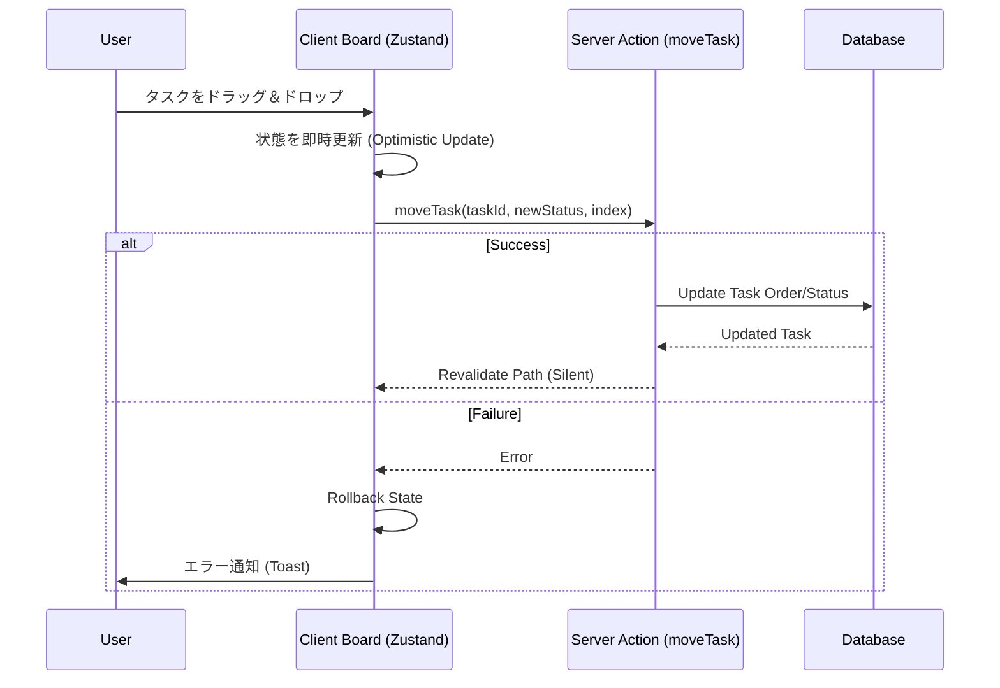
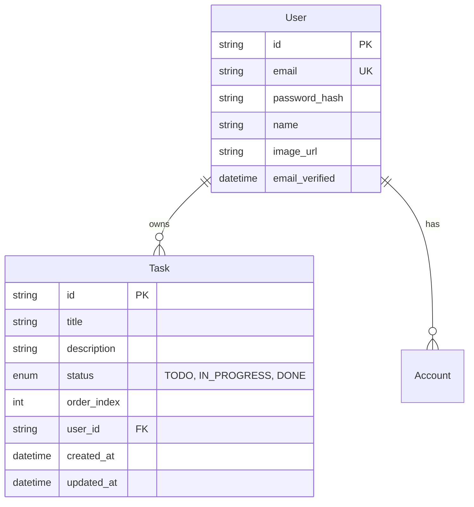
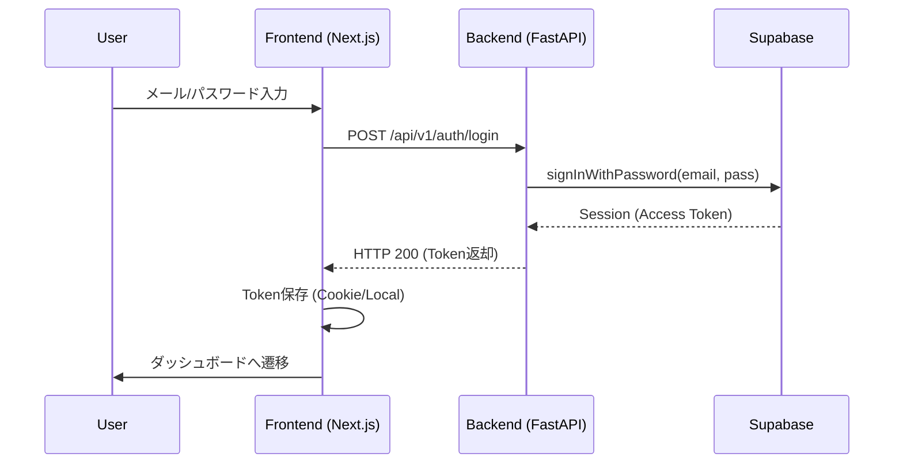
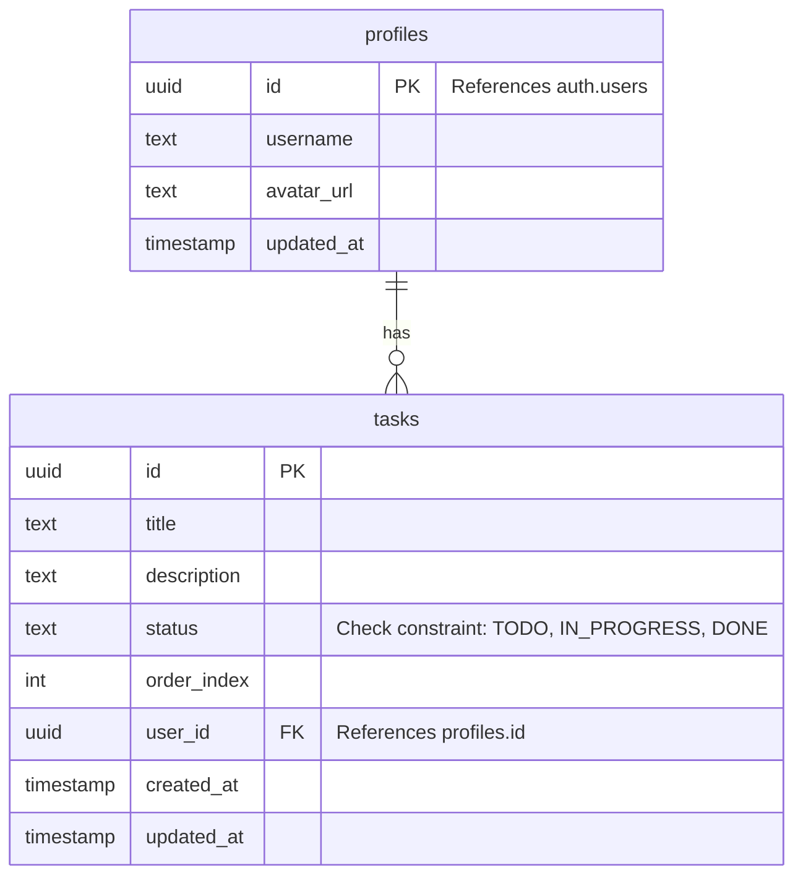

# cc-sdd による要件定義

gemini 上で `/kiro:xxx` コマンドを使用して設計を行う。
開発者はサービスの概要だけを入力に含めるだけでも、gemini が自動的に補完して設計を考えてくれる。

## 最新ドキュメント

- 要件定義
  - [requirements.md](../.kiro/specs/todo-service/requirements.md)
- 詳細設計
  - [design.md](../.kiro/specs/todo-service/design.md)
- 技術選定・調査
  - [research.md](../.kiro/specs/todo-service/research.md)

## 初期化

`/kiro:spec-init <feature name>` で設計概要が作成される

### プロンプト例

```
/kiro:spec-init モダンなデザインの Todo アプリケーションを Web サービスとして作成したい。
```

### 実際に出力されたもの

```
# Requirements Document

## Project Description (Input)
モダンなデザインの Todo アプリケーションを Web サービスとして作成する

## Requirements
<!-- Will be generated in /kiro:spec-requirements phase -->

```

## 新規作成

`/kiro:spec-requirements <feature name>` で要件定義が作成される

### プロンプト例

```
/kiro:spec-requirements todo-service
```

### 実際に出力されたもの

```
# 要件定義書 (Requirements Document)

## プロジェクト概要 (Project Description)
モダンなデザインの Todo アプリケーションを Web サービスとして作成する。

## 要件 (Requirements)

### Requirement 1: タスク管理機能 (Task Management)
**Objective:** ユーザーとして、タスクを効率的に管理したいため、タスクの作成・編集・削除を行いたい。

#### Acceptance Criteria
1. When [ユーザーがタスク作成ボタンをクリックした], the [Todo Service] shall [タスク入力フォームを表示する]
2. When [ユーザーが有効なタイトルでタスクを送信した], the [Todo Service] shall [新しいタスクを作成しリストに追加する]
3. When [ユーザーがタスクの削除操作を行った], the [Todo Service] shall [該当タスクをリストから削除する]
4. When [ユーザーがタスクの内容を編集して保存した], the [Todo Service] shall [タスクの情報を更新する]
5. If [タスク作成時にタイトルが空である], then the [Todo Service] shall [エラーメッセージを表示する]

### Requirement 2: タスクの状態管理と整理 (Task Status & Organization)
**Objective:** ユーザーとして、やるべきことを整理したいため、タスクの完了状態の切り替えやフィルタリングを行いたい。

#### Acceptance Criteria
1. When [ユーザーがタスクの完了チェックボックスをクリックした], the [Todo Service] shall [タスクのステータスを完了または未完了に切り替える]
2. When [ユーザーがフィルタリングオプション（すべて/未完了/完了）を選択した], the [Todo Service] shall [選択された状態のタスクのみを表示する]
3. When [ユーザーが一括削除操作（完了済みタスクの削除など）を選択した], the [Todo Service] shall [対象となる複数のタスクを一括で削除する]
4. The [Todo Service] shall [完了したタスクを視覚的に区別して表示する（例：取り消し線）]

### Requirement 3: 検索機能 (Search Functionality)
**Objective:** ユーザーとして、特定のタスクを素早く見つけたいため、キーワードによる検索を行いたい。

#### Acceptance Criteria
1. When [ユーザーが検索キーワードを入力した], the [Todo Service] shall [タイトルにそのキーワードを含むタスクのみをリストに表示する]
2. While [検索フィルターが適用されている], the [Todo Service] shall [該当するタスクがない場合に「見つかりませんでした」というメッセージを表示する]

### Requirement 4: モダンなUI/UX (Modern UI/UX)
**Objective:** ユーザーとして、快適に利用したいため、モダンでレスポンシブなデザインのインターフェースを利用したい。

#### Acceptance Criteria
1. The [Todo Service] shall [スマートフォン、タブレット、PCの各デバイスで適切に表示されるレスポンシブデザインを持つ]
2. When [ユーザーがタスク操作（追加・削除・完了）を行った], the [Todo Service] shall [滑らかなアニメーションフィードバックを提供する]
3. The [Todo Service] shall [ライトモードとダークモードの切り替えをサポートする]
4. The [Todo Service] shall [一貫性のあるモダンな配色とタイポグラフィを採用する]

### Requirement 5: データ永続化 (Data Persistence)
**Objective:** ユーザーとして、データを保持したいため、ブラウザを閉じてもタスクが保存されるようにしたい。

#### Acceptance Criteria
1. When [ユーザーがアプリケーションを再読み込みした], the [Todo Service] shall [前回保存されたタスクリストを復元して表示する]
2. While [データの同期や読み込みが発生している], the [Todo Service] shall [ローディング状態を視覚的に表示する]
3. If [データの保存や取得に失敗した], then the [Todo Service] shall [ユーザーに適切なエラーメッセージを表示する]
```

## 編集

`/kiro:spec-requirements <feature name>` + `要件の概要` で要件定義が編集される

### プロンプト例

```
/kiro:spec-requirements todo-service 次の機能を要件に含めて。

- ログイン機能
-- ユーザーはログインできること。
-- ユーザーはログアウトできること。
-- ログインしないとサービスにアクセスできないこと。
-- ログインIDはメールアドレスであること
-- パスワードは英数字記号含めて8文字以上であること

- ユーザー登録機能
-- ログインIDはメールアドレスであること（IDはユニークであること）
-- パスワードは英数字記号含めて8文字以上であること
-- 仮登録 URL を発行して、アクセスがあったときにユーザー登録を完了すること
-- ユーザー名は任意であること（空白のみや公序良俗に反するユーザー名は登録できないこと）
-- デフォルトアイコンは特定の人型アイコンであること（すべて同じでOK）
-- 任意のアイコンが設定できること

- ユーザー削除機能
-- ユーザーが削除できること

- ユーザー情報機能
-- ユーザー名が確認できること
-- ユーザー名の変更ができること
-- ユーザーアイコンの変更ができること
-- パスワードが変更できること（英数字記号含めて8文字以上）

- タスク管理機能
-- タスクのステータスは 「未完了」・「進行中」・「完了」であること
-- ユーザーは Kanban 方式でステータスを管理できること

- モダンなUI/UX
-- 日本語の他に英語に切り替えられること
```

### 実際に出力されたもの

```
# 要件定義書 (Requirements Document)

## プロジェクト概要 (Project Description)
ユーザー認証とモダンな UI を備えた、Kanban スタイルの Todo 管理 Web サービスを作成する。

## 要件 (Requirements)

### Requirement 1: 認証機能 (Authentication)
**Objective:** ユーザーとして、自分のデータを安全に管理したいため、アカウントによるアクセス制御を行いたい。

#### Acceptance Criteria
1. When [未認証のユーザーがサービスにアクセスした], the [Todo Service] shall [ログイン画面へリダイレクトする]
2. When [ユーザーが正しいメールアドレスとパスワードでログイン操作を行った], the [Todo Service] shall [認証を成功させ、メイン画面へ遷移する]
3. When [ユーザーがログアウト操作を行った], the [Todo Service] shall [セッションを終了し、ログイン画面へ遷移する]
4. If [入力されたパスワードが英数字記号を含まない、または8文字未満である], then the [Todo Service] shall [バリデーションエラーを表示する]
5. The [Todo Service] shall [ログインIDとしてメールアドレスを使用する]

### Requirement 2: ユーザー登録機能 (User Registration)
**Objective:** 新規ユーザーとして、サービスを利用開始したいため、アカウントを作成したい。

#### Acceptance Criteria
1. When [ユーザーが新規登録フォームで有効な情報を送信した], the [Todo Service] shall [仮登録メールを指定されたアドレスに送信する]
2. When [ユーザーが仮登録メール内のURLにアクセスした], the [Todo Service] shall [本登録を完了し、アカウントを有効化する]
3. If [登録しようとしたメールアドレスが既に存在する], then the [Todo Service] shall [登録できない旨のエラーを表示する]
4. If [ユーザー名が空白、または公序良俗に反する単語が含まれている], then the [Todo Service] shall [登録を拒否しエラーを表示する]
5. The [Todo Service] shall [新規登録時に特定の人型アイコンをデフォルトのユーザーアイコンとして設定する]
6. Where [ユーザーが任意の画像をアップロードした場合], the [Todo Service] shall [その画像をユーザーアイコンとして設定する]

### Requirement 3: ユーザー情報管理 (User Account Management)
**Objective:** ユーザーとして、自分の情報を最新に保つ、あるいは不要になった場合に削除したいため、プロフィール管理を行いたい。

#### Acceptance Criteria
1. The [Todo Service] shall [現在のユーザー名とアイコンを表示する]
2. When [ユーザーがユーザー名を変更した], the [Todo Service] shall [新しいユーザー名を保存する]
3. When [ユーザーが新しいアイコン画像をアップロードした], the [Todo Service] shall [ユーザーアイコンを更新する]
4. When [ユーザーがパスワード変更を行った], the [Todo Service] shall [新しいパスワード（英数字記号8文字以上）で更新する]
5. When [ユーザーがアカウント削除操作を行った], the [Todo Service] shall [ユーザーデータおよび関連する全タスクを削除する]

### Requirement 4: タスク管理とKanbanボード (Task Management & Kanban)
**Objective:** ユーザーとして、タスクの進捗を視覚的に把握したいため、Kanban 形式でステータスを管理したい。

#### Acceptance Criteria
1. The [Todo Service] shall [タスクのステータスとして「未完了(Todo)」「進行中(In Progress)」「完了(Done)」の3状態を持つ]
2. The [Todo Service] shall [タスクをステータスごとに列分けされた Kanban ボード形式で表示する]
3. When [ユーザーがタスクを別のステータスの列へドラッグ＆ドロップした], the [Todo Service] shall [タスクのステータスを移動先のステータスに更新する]
4. When [ユーザーが新しいタスクを作成した], the [Todo Service] shall [デフォルトで「未完了」ステータスに追加する]
5. When [ユーザーがタスクの内容を編集または削除した], the [Todo Service] shall [変更を即座にボード上に反映する]

### Requirement 5: モダンUIと国際化 (Modern UI/UX & i18n)
**Objective:** ユーザーとして、好みの言語と快適な操作感で利用したいため、多言語対応されたモダンなインターフェースを使いたい。

#### Acceptance Criteria
1. The [Todo Service] shall [日本語と英語の表示切り替え機能を提供する]
2. When [ユーザーが言語を切り替えた], the [Todo Service] shall [UI上のテキストを選択された言語で表示する]
3. The [Todo Service] shall [PC、タブレット、スマートフォンで適切に表示されるレスポンシブデザインを持つ]
```

## 確定

`/kiro:spec-design <feature name> -y` で要件定義が確定される。
サービスを開発するための技術選定を調査しながら、自動的に行なってくれる。

### プロンプト例

```
/kiro:spec-design todo-service -y
```

### 実際に出力されたもの
````
# 設計書 (Design Document)

---
**目的**: 実装者間の解釈のブレを防ぎ、一貫した実装を保証するための詳細を提供する。

**アプローチ**:
- 実装判断に直結する必須セクションを含める
- 実装ミスを防ぐために重要な場合を除き、オプションのセクションは省略する
- 機能の複雑さに応じた詳細レベルにする
- 長い散文よりも図や表を使用する
---

## 概要 (Overview)
本機能は、ユーザーが個人のタスクを視覚的に管理できる Kanban スタイルの Todo アプリケーションを提供する。ユーザーは直感的なドラッグ＆ドロップ操作でタスクのステータスを変更でき、多言語対応されたモダンなインターフェースを通じてサービスを利用できる。

### 目標 (Goals)
- Next.js App Router を用いたパフォーマンスの高いフルスタックアプリケーションの構築
- `dnd-kit` を採用したアクセシブルでスムーズなドラッグ＆ドロップ体験の提供
- NextAuth.js による堅牢な認証とセッション管理
- レスポンシブかつ多言語対応 (i18n) された UI の実現

### 非目標 (Non-Goals)
- 複数ユーザーによるリアルタイム同時編集（コラボレーション機能）
- タスクへのファイル添付機能（将来検討）
- オフライン動作の完全サポート

## 要件追跡 (Requirements Traceability)

| 要件ID | 概要 | コンポーネント | インターフェース |
|--------|------|----------------|------------------|
| 1.1, 1.2 | ログインと認証ガード | Middleware, LoginPage | NextAuth Session |
| 1.3 | ログアウト | UserMenu | signOut() |
| 1.4, 1.5 | パスワード検証, ID仕様 | AuthSchema, RegisterForm | Zod Schema |
| 2.1, 2.2 | ユーザー登録フロー | RegisterForm, EmailService | sendVerificationEmail |
| 2.3, 2.4 | 登録バリデーション | RegisterForm, UserService | createUser |
| 2.5, 2.6 | デフォルト/任意アイコン | UserService, ImageUploader | updateProfile |
| 3.1 - 3.5 | アカウント管理 | ProfilePage, SettingsForm | updateUser, deleteUser |
| 4.1, 4.2 | タスク表示・列定義 | BoardContainer, KanbanBoard | Task |
| 4.3 | ステータス移動 (DnD) | KanbanBoard, TaskAction | moveTask |
| 4.4 | タスク作成 | CreateTaskModal | createTask |
| 4.5 | 編集・削除 | TaskCard, TaskAction | updateTask, deleteTask |
| 5.1, 5.2 | 多言語切り替え | LanguageSwitcher | useTranslations |
| 5.3 | レスポンシブUI | Layout, TailwindConfig | CSS Classes |

## アーキテクチャ (Architecture)

### アーキテクチャパターンと境界 (Architecture Pattern & Boundary Map)

本システムは **Next.js Fullstack Architecture (App Router)** を採用する。フロントエンドとバックエンドを単一のフレームワーク内で統合し、Server Components によるデータ取得と Server Actions によるデータ変異（Mutation）を行う。

```mermaid
graph TB
    subgraph Client [Client Layer]
        Browser[Browser]
        Zustand[Local Store (Optimistic)]
    end

    subgraph Server [Next.js Server Layer]
        Page[Server Page / Layout]
        Action[Server Actions]
        Auth[NextAuth.js]
        API[Internal API Routes]
    end

    subgraph Data [Data Layer]
        Prisma[Prisma ORM]
        DB[(PostgreSQL)]
    end

    Browser -- "Interactivity (DnD)" --> Zustand
    Browser -- "Fetch HTML/RSC" --> Page
    Browser -- "Form Post / RPC" --> Action
    Page -- "Fetch Data" --> Prisma
    Action -- "Mutate Data" --> Prisma
    Action -- "Auth Check" --> Auth
    Prisma --> DB
```

**アーキテクチャ統合**:
- **パターン**: Next.js App Router。UI と API ロジックをコロケーションし、開発効率と型安全性を最大化する。
- **境界**:
  - `Client Components`: ユーザーインタラクション（DnD、フォーム入力）を担当。
  - `Server Components`: 初期データ取得、認証ガードを担当。
  - `Server Actions`: データベースへの書き込み、バリデーション、ビジネスロジックを担当。

### 技術スタック (Technology Stack)

| レイヤー | 選択 / バージョン | 役割 | 備考 |
|----------|-------------------|------|------|
| Frontend | Next.js 15 / React 19 | UIフレームワーク | App Router, Server Components |
| Language | TypeScript 5.x | 開発言語 | 厳格な型安全性 (Strict Mode) |
| Styling | Tailwind CSS | スタイリング | レスポンシブ対応、Utility-first |
| State | Zustand / Context | クライアント状態管理 | DnD時の楽観的更新に使用 |
| DnD Lib | @dnd-kit/core | ドラッグ＆ドロップ | アクセシビリティ対応、軽量 |
| Backend | Next.js Server Actions | API/コントローラー | RPCスタイルのバックエンドロジック |
| Auth | NextAuth.js (v5) | 認証・認可 | JWTセッション、Credentialsプロバイダ |
| ORM | Prisma | データアクセス | スキーマ定義、マイグレーション |
| Database | PostgreSQL | 永続化ストレージ | |
| i18n | next-intl | 国際化 | ロケール管理、翻訳リソース |

## システムフロー (System Flows)

### タスク移動と楽観的更新 (Task Move Flow)



## コンポーネントとインターフェース (Components and Interfaces)

### コンポーネントサマリ (Summary)

| コンポーネント | ドメイン/層 | 意図 | 要件 | 依存 (P0:必須) | 契約 |
|----------------|-------------|------|------|----------------|------|
| `BoardPage` | Page (Server) | ボード画面の構成と初期データ取得 | 4.1, 4.2 | TaskService (P0) | Props |
| `KanbanBoard` | UI (Client) | DnDコンテキストと列の管理 | 4.2, 4.3 | dnd-kit (P0), useTaskStore (P0) | Event |
| `TaskCard` | UI (Client) | タスクの表示とドラッグ操作 | 4.1, 4.5 | dnd-kit (P0) | Props |
| `AuthMiddleware`| Infra | 未認証アクセスの保護 | 1.1 | NextAuth (P0) | - |
| `TaskActions` | Server | タスク操作のビジネスロジック | 4.3, 4.4 | Prisma (P0), Auth (P0) | RPC |

### [Domain: Task Management]

#### KanbanBoard (Client Component)

| 項目 | 詳細 |
|------|------|
| 意図 | ドラッグアンドドロップのコンテキスト (`DndContext`) を提供し、列 (`Column`) を配置する。 |
| 要件 | 4.2, 4.3, 4.5 |

**責任と制約**
- `DndContext`、`Sensors` の設定。
- ドラッグ終了イベント (`onDragEnd`) のハンドリング。
- サーバーアクション呼び出し時の楽観的更新の管理。

**依存関係**
- Inbound: `BoardPage` (Server Component) から初期タスクデータを受け取る。
- Outbound: `TaskActions.moveTask` (Server Action) を呼び出す。

**契約 (State/Event)**
- **State Model**: `tasks: Task[]` (Zustand store または Local State)
- **Events**:
  - `onDragEnd(event: DragEndEvent)`: ドロップ位置の計算とAPI呼び出し。

#### TaskActions (Server Actions)

| 項目 | 詳細 |
|------|------|
| 意図 | タスクに関するCRUD操作とステータス変更を行うサーバーサイドロジック。 |
| 要件 | 4.3, 4.4, 4.5 |

**契約 (Service Interface / RPC)**

```typescript
// actions/task.ts

type ActionState = {
  success: boolean;
  message?: string;
  errors?: Record<string, string[]>;
};

// タスク作成
export async function createTask(
  prevState: ActionState, 
  formData: FormData
): Promise<ActionState>;

// タスク移動（ステータス・順序変更）
export async function moveTask(
  taskId: string, 
  newStatus: TaskStatus, 
  newIndex: number
): Promise<ActionState>;

// タスク削除
export async function deleteTask(taskId: string): Promise<ActionState>;
```
- **Preconditions**: ユーザーが認証済みであること (`auth()` check)。
- **Postconditions**: 成功時、`revalidatePath('/board')` を呼び出しキャッシュを更新する。

### [Domain: User & Auth]

#### AuthService (NextAuth Config)

| 項目 | 詳細 |
|------|------|
| 意図 | 認証プロバイダの設定とセッション管理。 |
| 要件 | 1.1, 1.2, 1.3 |

**実装ノート**
- `auth.config.ts`: Credentials Provider を使用。
- `authorize` 関数内でパスワードハッシュ (`bcrypt`) を検証する。
- セッションには `userId` を含めるようにコールバックを拡張する。

#### EmailService (Utility)

| 項目 | 詳細 |
|------|------|
| 意図 | 仮登録メール等の送信処理。 |
| 要件 | 2.1 |

**インターフェース**
```typescript
interface EmailService {
  sendVerificationEmail(to: string, token: string): Promise<void>;
}
```
**実装ノート**
- プロトタイプ段階ではコンソール出力 (`console.log`) で代用する（Mock実装）。本番環境では SendGrid 等への差し替えを想定。

## データモデル (Data Models)

### 論理データモデル (Logical Data Model)

**ER Diagram (Simplified)**


### 物理データモデル (Physical Data Model - Prisma)

PostgreSQL を想定。

```prisma
model User {
  id            String    @id @default(cuid())
  name          String?
  email         String    @unique
  password      String?
  image         String?
  emailVerified DateTime?
  tasks         Task[]
  accounts      Account[]
}

model Task {
  id          String     @id @default(cuid())
  title       String
  description String?
  status      TaskStatus @default(TODO)
  orderIndex  Int        @default(0)
  userId      String
  user        User       @relation(fields: [userId], references: [id], onDelete: Cascade)
  createdAt   DateTime   @default(now())
  updatedAt   DateTime   @updatedAt

  @@index([userId])
}

enum TaskStatus {
  TODO
  IN_PROGRESS
  DONE
}
```

## エラーハンドリング (Error Handling)

### エラー戦略
- **バリデーションエラー**: Zod を使用して Server Actions 入力時に検証し、フォームにエラーメッセージを返す。
- **認証エラー**: Middleware で捕捉し、ログインページへリダイレクト。API 呼び出し時は 401/403 相当のエラーメッセージを返す。
- **システムエラー**: グローバルな `error.tsx` で捕捉し、ユーザーフレンドリーなメッセージを表示する。

## テスト戦略 (Testing Strategy)

### Unit Tests
- `TaskActions`: 認証ガード、バリデーション、DB呼び出しのモックテスト。
- `AuthLogic`: パスワードハッシュ比較、バリデーションルールのテスト。

### Integration Tests
- `KanbanBoard`: DnD 操作後の状態更新とコールバック呼び出しの確認（React Testing Library）。
- `RegisterFlow`: フォーム入力から完了画面までのフロー。

### E2E Tests (Optional for Prototype)
- Playwright を使用し、ログイン → タスク作成 → ドラッグ移動 → ログアウト の主要フローを検証。
````

## 選定技術の編集

`/kiro:spec-design todo-service` + `技術・設計思想の概要` で選定技術や設計思想を編集する。

### プロンプト例

```
/kiro:spec-design todo-service 次の技術・思想で設計して。

- このリポジトリはモノレポでフロントエンド／バックエンドの両方を管理
-- フロントエンド／バックエンドの開発方法を readme.md に記述

- フロントエンド
-- frontend ディレクトリに type script + next.js プロジェクトを配置
-- backend の rest api を使用してデータを取得・保存し、UIを表示
-- backend の rest api を使用してログイン認証を行う

- バックエンド
-- backend ディレクトリに python + fast-api + DB(supabase) プロジェクトを配置
-- python は uv パッケージマネージャで管理
-- python + fast-api で rest api を定義
-- rest api は DB(supabase) に CRUD 操作を定義

- 開発環境
-- docker を使用してフロントエンド／バックエンドを開発
-- 開発用の共通情報は .env ファイルで管理
-- 開発用の認証情報は .env.local で管理(.env.local.example に記入例を記述)

- リリース方法
-- フロントエンド／バックエンド(DBを除く)は vercel にリリース
-- バックエンドの DB は supabase にリリース
-- フロントエンド／バックエンドは github actions を使用してデプロイ
-- 本番向けの認証情報は github actions で github で管理している secrets.xxx 環境変数で埋め込み、デプロイ
```

### 実際に出力されたもの

````
# 設計書 (Design Document)

---
**目的**: 実装者間の解釈のブレを防ぎ、一貫した実装を保証するための詳細を提供する。

**アプローチ**:
- 実装判断に直結する必須セクションを含める
- 実装ミスを防ぐために重要な場合を除き、オプションのセクションは省略する
- 機能の複雑さに応じた詳細レベルにする
- 長い散文よりも図や表を使用する
---

## 概要 (Overview)

本機能は、ユーザーが個人のタスクを視覚的に管理できる Kanban スタイルの Todo アプリケーションである。フロントエンドとバックエンドを分離したモノレポ構成を採用し、モダンな UI と堅牢な API を提供する。

### 目標 (Goals)
- フロントエンド (Next.js) とバックエンド (FastAPI) を完全に分離したモノレポ構成の確立
- Supabase を活用した認証およびデータ永続化
- Docker を使用した再現性の高い開発環境の提供
- Vercel への統合デプロイメント

### 非目標 (Non-Goals)
- リアルタイムコラボレーション（WebSocket等）
- 複雑な権限管理（今回は個人タスク管理のみ）

## アーキテクチャ (Architecture)

### アーキテクチャパターンと境界 (Architecture Pattern & Boundary Map)

**Monorepo Split Architecture** を採用する。フロントエンドはプレゼンテーションとユーザー操作に集中し、バックエンドはビジネスロジックとデータアクセス、認証のゲートウェイとして機能する。

```mermaid
graph TB
    subgraph Client [User Client]
        Browser[Browser]
    end

    subgraph Frontend [Next.js (Vercel)]
        UI[React Components]
        NextServer[Next.js Server (BFF/Proxy)]
    end

    subgraph Backend [FastAPI (Vercel)]
        API[REST API]
        AuthService[Auth Service]
        TaskService[Task Service]
    end

    subgraph Infra [Supabase]
        SupabaseAuth[Auth Provider]
        SupabaseDB[(PostgreSQL)]
    end

    Browser -- "HTTPS (UI)" --> UI
    UI -- "API Calls" --> NextServer
    NextServer -- "Internal API / Proxy" --> API
    API -- "Auth Check" --> AuthService
    API -- "CRUD" --> TaskService
    AuthService -- "JWT / Verify" --> SupabaseAuth
    TaskService -- "Query" --> SupabaseDB
```

**アーキテクチャ統合**:
- **パターン**: Backend for Frontend (BFF) 的な Next.js と、ピュアな REST API (FastAPI) の組み合わせ。
- **境界**:
  - `frontend/`: UI 描画、クライアント状態管理、バックエンド API へのプロキシ。
  - `backend/`: データベース操作、認証ロジック、API 定義。
- **ステアリング準拠**: モノレポ構成によるコードベースの一元管理。

### 技術スタック (Technology Stack)

| レイヤー | 選択 / バージョン | 役割 | 備考 |
|----------|-------------------|------|------|
| Frontend | Next.js 15 / TypeScript | UI / BFF | App Router 使用 |
| Backend | Python 3.11 / FastAPI | REST API | `uv` でパッケージ管理 |
| Database | Supabase (PostgreSQL) | データストア | バックエンドからアクセス |
| Auth | Supabase Auth | 認証基盤 | バックエンド経由で利用 |
| Infra | Docker / Vercel | 開発 / デプロイ | モノレポ対応設定 |

## システムフロー (System Flows)

### ログインフロー (Login Flow)



## 要件追跡 (Requirements Traceability)

| 要件ID | 概要 | コンポーネント | インターフェース |
|--------|------|----------------|------------------|
| 1.1, 1.2 | ログイン認証 | FE: LoginForm, BE: AuthRouter | POST /auth/login |
| 1.3 | ログアウト | FE: UserMenu, BE: AuthRouter | POST /auth/logout |
| 2.1 - 2.4 | ユーザー登録 | FE: RegisterForm, BE: UserRouter | POST /users/register |
| 3.1 - 3.4 | ユーザー情報管理 | FE: ProfilePage, BE: UserRouter | PUT /users/me |
| 4.1 - 4.3 | タスク管理・Kanban | FE: KanbanBoard, BE: TaskRouter | GET/POST/PUT /tasks |
| 5.1, 5.2 | 多言語対応 | FE: i18nProvider | - |

## コンポーネントとインターフェース (Components and Interfaces)

### コンポーネントサマリ (Summary)

| コンポーネント | ドメイン/層 | 意図 | 要件 | 依存 (P0:必須) | 契約 |
|----------------|-------------|------|------|----------------|------|
| `frontend/app` | UI | 画面描画とルーティング | 5.1-5.3 | Backend API (P0) | - |
| `backend/main` | API | エントリーポイントと設定 | - | FastAPI (P0) | HTTP |
| `backend/routers/auth` | Auth | 認証処理のハンドリング | 1.1-1.5 | Supabase Client (P0) | API |
| `backend/routers/tasks` | Task | タスクCRUDの実装 | 4.1-4.5 | Supabase DB (P0) | API |

### [Domain: Backend API]

#### Auth Router (`backend/routers/auth.py`)

| 項目 | 詳細 |
|------|------|
| 意図 | ログイン、登録、トークン管理のエンドポイントを提供する。 |
| 要件 | 1.1, 1.2, 2.1 |

**責任と制約**
- Supabase Auth SDK をラップして利用する。
- パスワード等の機密情報はログ出力しない。

**API Contract**

| Method | Endpoint | Request | Response | Errors |
|--------|----------|---------|----------|--------|
| POST | `/api/v1/auth/login` | `{email, password}` | `{access_token, token_type}` | 401 |
| POST | `/api/v1/auth/signup` | `{email, password, name}` | `{msg, user_id}` | 400, 409 |

#### Task Router (`backend/routers/tasks.py`)

| 項目 | 詳細 |
|------|------|
| 意図 | タスクの取得、作成、更新、削除、並び替えを行う。 |
| 要件 | 4.1, 4.2, 4.3 |

**責任と制約**
- 認証済みユーザー (`Depends(get_current_user)`) のみアクセス可能。
- `user_id` に紐づくデータのみを操作する（Row Level Security 相当のフィルタリングをアプリ側でも意識する）。

**API Contract**

| Method | Endpoint | Request | Response | Errors |
|--------|----------|---------|----------|--------|
| GET | `/api/v1/tasks` | - | `List[Task]` | 401 |
| POST | `/api/v1/tasks` | `TaskCreate` | `Task` | 422 |
| PUT | `/api/v1/tasks/{id}` | `TaskUpdate` | `Task` | 404 |

### [Domain: Frontend UI]

#### KanbanBoard (`frontend/components/KanbanBoard.tsx`)

| 項目 | 詳細 |
|------|------|
| 意図 | タスクを列ごとに表示し、DnD操作を提供する。 |
| 要件 | 4.1 - 4.3 |

**Implementation Notes**
- `dnd-kit` を使用。
- ドロップ時に `PUT /api/v1/tasks/{id}` を呼び出し、ステータスと `order_index` を更新する。

## データモデル (Data Models)

### 物理データモデル (Physical Data Model - Supabase/PostgreSQL)



**実装ノート**:
- Supabase の `auth.users` テーブルと連携するため、`profiles` テーブルを作成し、トリガーを用いて `auth.users` 作成時に自動的にレコードを作成するパターンを推奨するが、今回はシンプルにバックエンド API 経由で操作することを主とするため、API ロジック内で整合性を保つ。

## エラーハンドリング (Error Handling)

### エラー戦略
- **Backend**: FastAPI の `HTTPException` を使用し、JSON 形式でエラー詳細（code, message）を返す。
- **Frontend**: API クライアント（axios または fetch ラッパー）でステータスコードを監視し、401 ならログイン画面へ、それ以外は Toast 通知でエラーを表示する。

## テスト戦略 (Testing Strategy)

### Unit Tests
- **Backend**: `pytest` を使用。Router のロジック、Pydantic モデルのバリデーションをテスト。DB 依存部分は `unittest.mock` でモック化。
- **Frontend**: `Vitest` + `React Testing Library` でコンポーネントのレンダリングテスト。

### Integration Tests
- **API**: Docker コンテナ上のテスト用 DB に対して実際にリクエストを投げる API テスト。

## 開発・デプロイ構成 (Dev & Ops)

### 開発環境
- `docker-compose.yml`:
  - `frontend`: Node.js image, port 3000
  - `backend`: Python image, port 8000
  - ホットリロード有効化（Volume mount）

### デプロイ (Vercel)
- `vercel.json` によるルーティング設定:
  - `api/` -> `backend/api/index.py` (FastAPI handler)
  - その他 -> Frontend
````

## 選定技術の確定

`/kiro:spec-tasks <feature name> -y` で 選定技術や設計思想を確定する。
サービスの詳細設計に従ってタスクを作成してくれる。

### プロンプト例

```
/kiro:spec-tasks todo-service -y
```

### 実際に出力されたもの

```
# Implementation Tasks

- [ ] 1. Project Initialization & Infrastructure
- [ ] 1.1 Establish Monorepo & Development Environment
  - Initialize git repository with monorepo structure (`frontend/`, `backend/`)
  - Configure `docker-compose.yml` for Next.js and FastAPI services
  - Set up local Supabase environment using Supabase CLI (`supabase init`, `supabase start`)
  - configure `.env` files for local development secrets
  - _Requirements: 5.3_

- [ ] 1.2 Setup Frontend Application (P)
  - Initialize Next.js 16 project with TypeScript and App Router
  - Configure Tailwind CSS for styling
  - Set up `next-intl` for internationalization support
  - Create base layout with responsive design scaffold
  - _Requirements: 5.1, 5.2, 5.3_

- [ ] 1.3 Setup Backend Application (P)
  - Initialize Python 3.14 project with `uv` package manager
  - Install FastAPI and standard dependencies (pydantic, uvicorn)
  - Install Supabase Python client
  - Create basic API entry point and health check endpoint
  - _Requirements: 1.1_

- [ ] 2. Backend Implementation: Authentication & Users
- [ ] 2.1 Implement Authentication API
  - Create Auth Router for Login and Signup
  - Integrate Supabase Auth for sign-up and sign-in actions
  - Implement JWT validation dependency for protected routes
  - _Requirements: 1.1, 1.2, 1.3, 1.4, 1.5, 2.1, 2.2, 2.3, 2.4_

- [ ] 2.2 Implement User Profile API
  - Create User Router for retrieving and updating profile data
  - Implement endpoint to get current user info (`/users/me`)
  - Implement endpoint to update user profile (name, avatar) and password
  - Implement endpoint for account deletion
  - _Requirements: 2.5, 2.6, 3.1, 3.2, 3.3, 3.4, 3.5_

- [ ] 3. Backend Implementation: Task Management
- [ ] 3.1 Implement Task CRUD API
  - Define Database Schema for Tasks (via Supabase migration)
  - Create Task Router with CRUD endpoints (Get, Create, Update, Delete)
  - Implement logic for task status updates and ordering
  - Ensure Row Level Security (RLS) or API-level filtering by user ID
  - _Requirements: 4.1, 4.2, 4.3, 4.4, 4.5_

- [ ] 4. Frontend Implementation: Authentication
- [ ] 4.1 Implement Authentication Logic & UI
  - Configure NextAuth.js (v5) with Credentials Provider connecting to Backend API
  - Create Login Page with form validation
  - Create Registration Page with form validation
  - Implement Middleware for route protection (redirect unauthenticated users)
  - _Requirements: 1.1, 1.2, 1.4, 1.5, 2.1, 2.2, 2.3, 2.4_

- [ ] 5. Frontend Implementation: User Profile
- [ ] 5.1 Implement User Settings UI
  - Create Profile Page displaying user info
  - Implement forms for updating username and password
  - Implement avatar upload and update functionality
  - Add account deletion confirmation and action
  - _Requirements: 1.3, 2.5, 2.6, 3.1, 3.2, 3.3, 3.4, 3.5_

- [ ] 6. Frontend Implementation: Kanban Board
- [ ] 6.1 Implement Kanban UI & DnD
  - Create Board Layout with columns for Todo, In Progress, Done
  - Implement Drag and Drop using `@dnd-kit/core`
  - Manage local state for smooth optimistic UI updates
  - _Requirements: 4.1, 4.2, 4.3_

- [ ] 6.2 Implement Task Operations
  - Create Modal/Form for adding new tasks
  - Implement edit and delete functionality for task cards
  - Connect DnD events to Backend API for status/order updates
  - _Requirements: 4.4, 4.5_

- [ ] 7. Deployment & Integration
- [ ] 7.1 Configure Deployment Workflow
  - Create `vercel.json` for routing/rewrites
  - Configure GitHub Actions for Database Migrations (`supabase db push`)
  - Configure GitHub Actions for Vercel Deployment (`vercel deploy`)
  - verify production build
  - _Requirements: 5.3_
```

## タスクと Github Issues の連携

Github MCP Server を使用して cc-sdd が作成したタスクを Github Issues に作成する。
セットアップ方法は [setup-github-mcp-server.md](./setup-github-mcp-server.md) を参照。

### プロンプト例

```
github mcp server 経由で Github Issues に tasks.json で定義したタスクを日本語で作成。
`.github/ISSUE_TEMPLATE/feature_request.yml` のフォーマットにしたがって作成すること。まずは1.を作成。
```

うまく行かない場合は gemini-cli を再起動する。
以下のようなログが出力されていれば起動されている。
```
3. /help for more information.

ℹ Resources updated for server: github

ℹ Tools updated for server: github
```

### 実際に出力されたもの

```
✦ .kiro/specs/todo-service/tasks.md の内容を確認します。

╭──────────────────────────────────────────────────────────────────────────────╮
│ ✓  ReadFile .kiro\specs\todo-service\tasks.md                                │
│                                                                              │
╰──────────────────────────────────────────────────────────────────────────────╯
✦ Github Issue「プロジェクト初期化とインフラ構築」を作成します。

╭──────────────────────────────────────────────────────────────────────────────╮
│ ✓  issue_write (github MCP Server) {"method":"create","body":"### Descripti… │
│                                                                              │
│ {"id":"3762754763","url":"https://github.com/dcom-kishi/todo-service/issues/ │
│ 12"}                                                                         │
╰──────────────────────────────────────────────────────────────────────────────╯
✦ Issue 12を作成しました。続いて、2～7についても作成しますか？
```