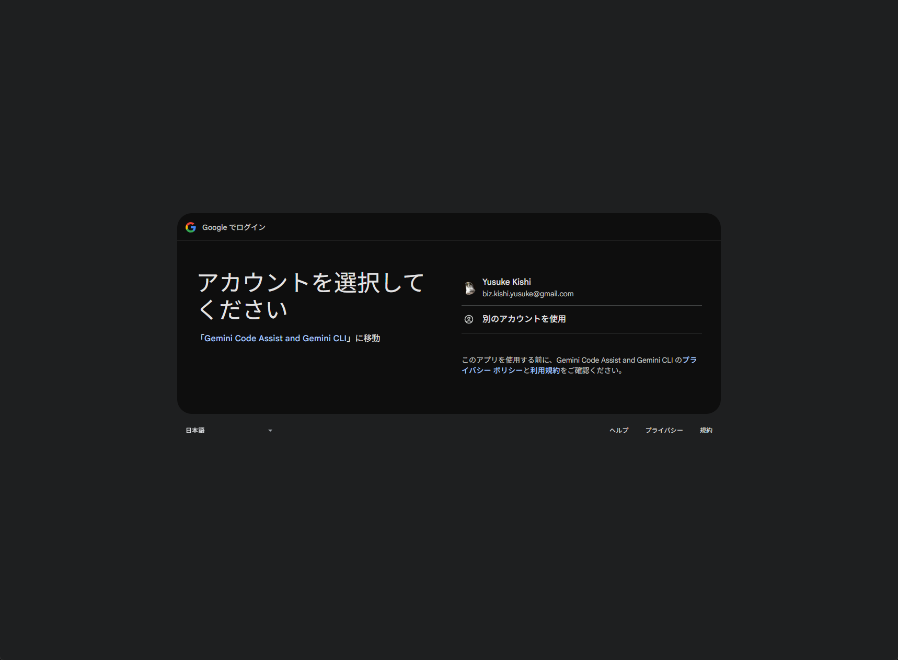
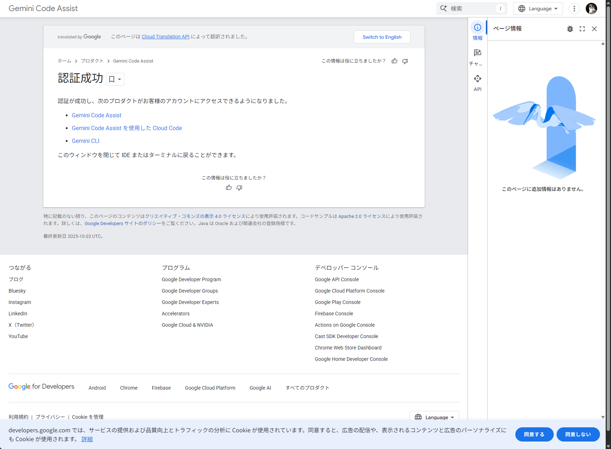
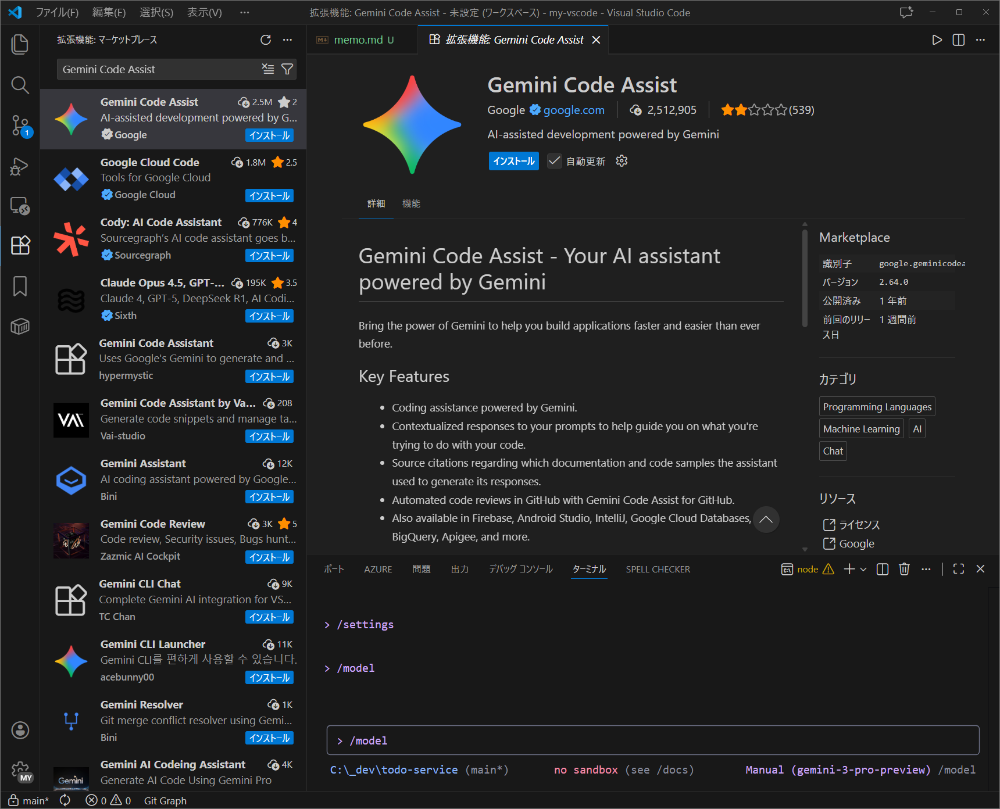
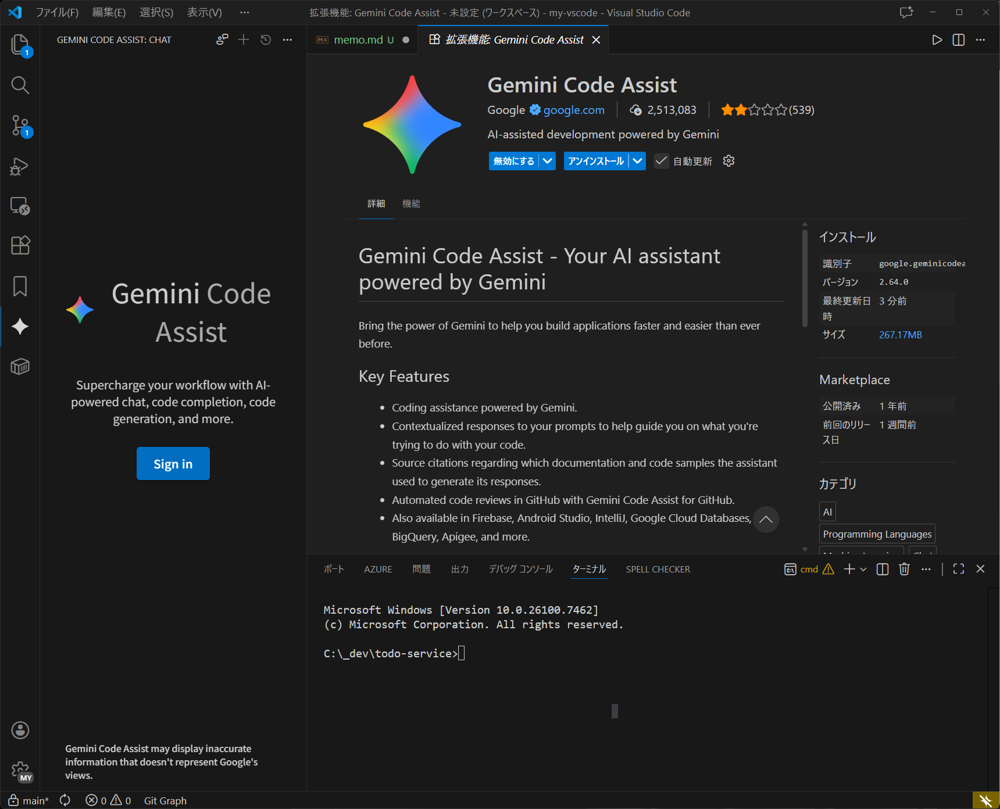
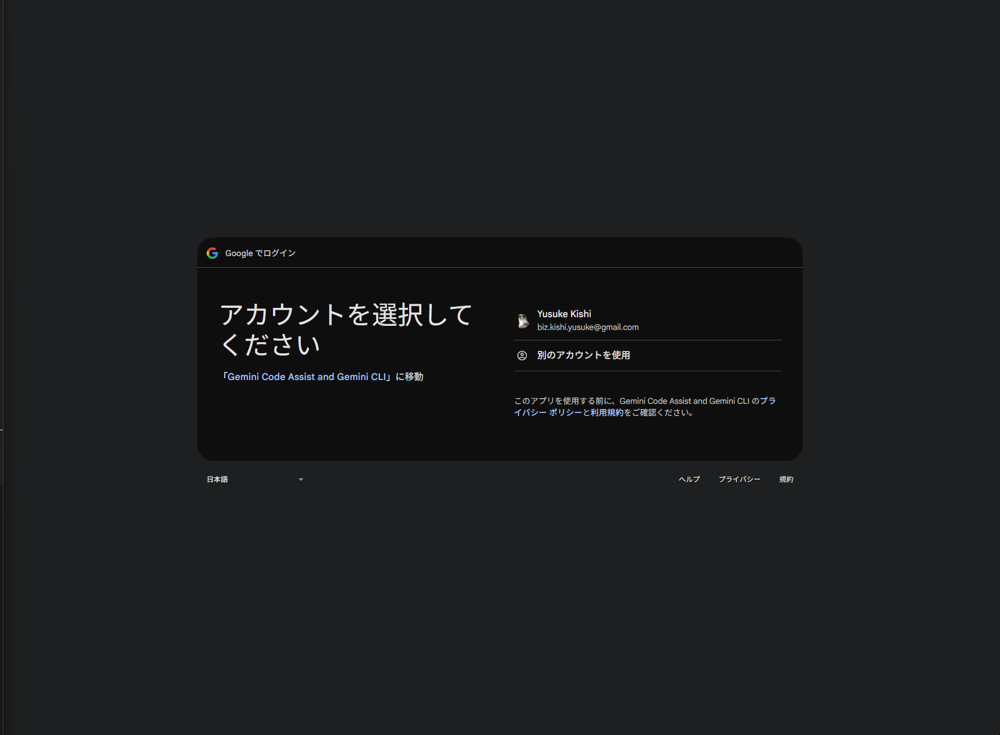
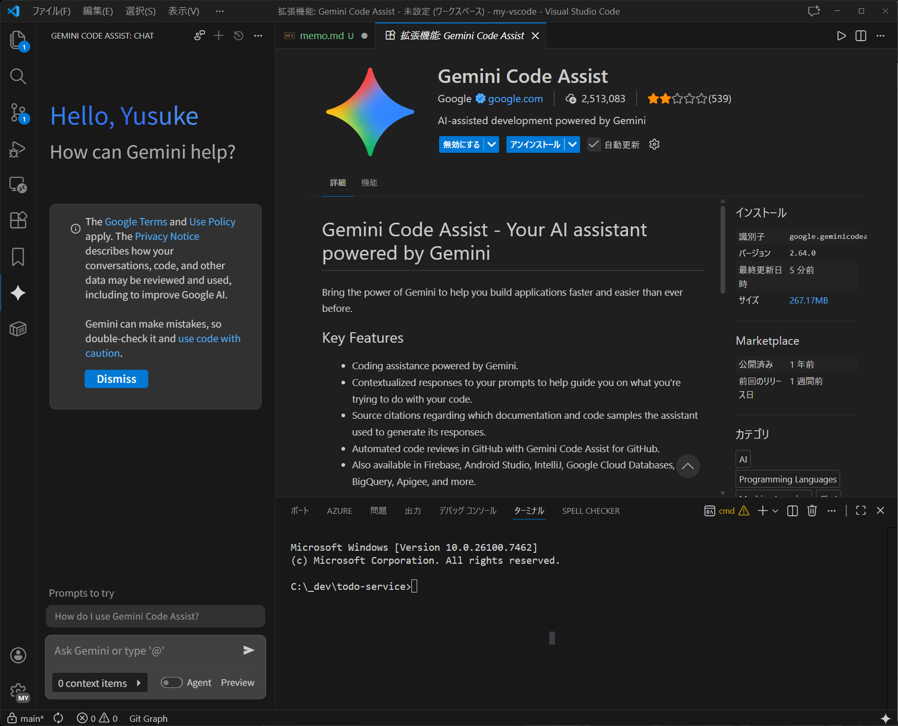
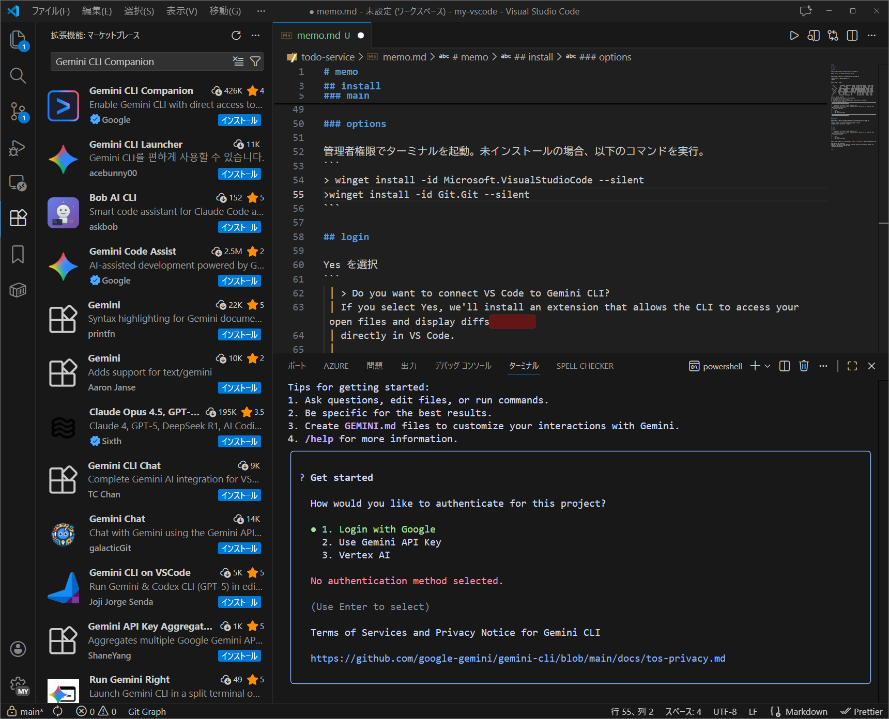

# 開発環境セットアップ

本プロジェクトの開発環境構築手順です。

## 1. 前提条件のインストール

管理者権限でターミナルを起動し、以下のコマンドを実行して必要なツールをインストールします。

```powershell
# Node.js (LTS)
winget install -id OpenJS.NodeJS.LTS --silent

# VS Code
winget install -id Microsoft.VisualStudioCode --silent
```

インストール完了後、ターミナルを再起動してください。

## 2. Gemini CLI のセットアップ

### インストール

管理者権限のターミナルで以下を実行します。

```powershell
npm install -g @google/gemini-cli
gemini
```

### ログインと初期設定

`gemini` コマンド実行後、対話形式でセットアップを行います。

1. **VS Code 連携**:
   - `Do you want to connect VS Code to Gemini CLI?` と聞かれたら `Yes` を選択します。
   - ※ 自動インストールに失敗した場合は、VS Code 拡張機能マーケットプレイスから `Gemini CLI Companion` を手動でインストールしてください。

2. **認証**:
   - `Login with Google` を選択し、ブラウザで Google アカウント認証を行います。
     
     

1. **モデル設定 (Gemini 3 の有効化)**:
   - Gemini CLI 内で `/settings` コマンドを入力します。
   - `Preview Features (e.g., models)` を選択し `true` に設定します。
   - `/model` コマンドを入力し、`Auto (Gemini 3)` が選択可能になっていることを確認します。
     

## 3. VS Code のセットアップ

### 拡張機能のインストール

VS Code マーケットプレイスから以下の拡張機能をインストールします。

1. **Gemini Code Assist**
   - インストール後、サイドバーのアイコンから `Sign in` を行い、Google アカウントで認証してください。
     
     
     

2. **Gemini CLI Companion**
   - Gemini CLI のセットアップ時にインストールされていない場合は、手動でインストールします。
     

## 4. 仕様駆動開発ツール (cc-sdd) のセットアップ

本プロジェクトでは AI-DLC (AI Development Life Cycle) を回すために `cc-sdd` を使用します。

### インストール

プロジェクトのルートディレクトリで以下のコマンドを実行します。
`--lang ja` オプションにより日本語環境向けにセットアップされます。

```bash
npx cc-sdd@latest --gemini --lang ja
```

### 使用方法

Gemini CLI を再起動（一度 `exit` して再度 `gemini` 起動）すると、以下のカスタムコマンドが使用可能になります。
詳細は `GEMINI.md` を参照してください。

- `/kiro:spec-init <作りたいもの>` : 仕様書のドラフト作成を開始
- `/kiro:spec-requirements {feature}` : 要件定義の作成
- `/kiro:spec-design {feature}` : 設計書の作成
- `/kiro:spec-tasks {feature}` : タスクの作成
- `/kiro:spec-impl {feature}` : 実装の開始
- `/kiro:spec-status {feature}` : 進捗確認
